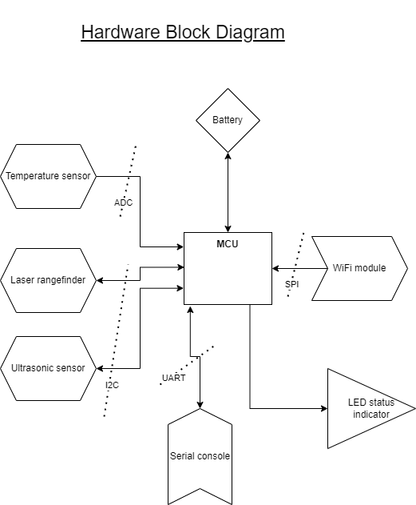
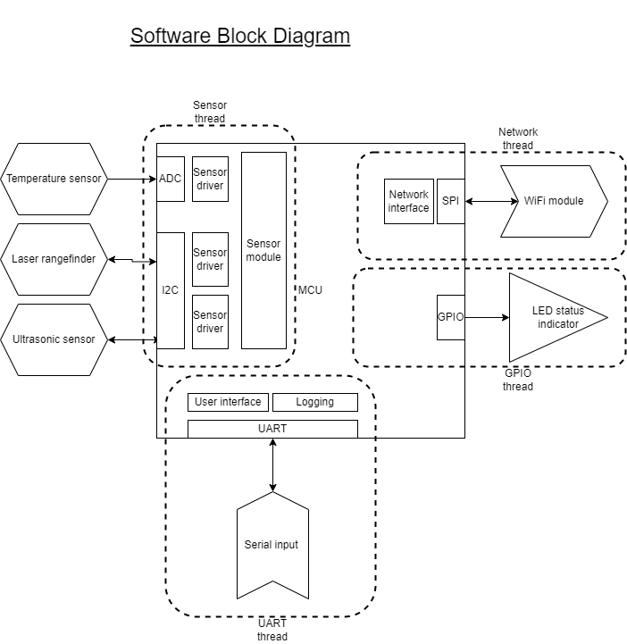
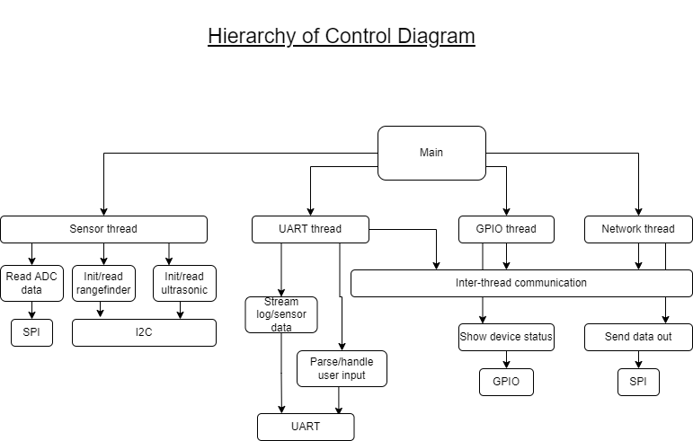

# Door Monitor

## Overview

I am constantly wondering if I left my garage open, oftentimes turning the car
around after having driven away for a few minutes to check if I did. I want a 
remote monitoring solution that will allow me to perform this check whether I am
at dinner with friends, at work, or otherwise unable to confirm the state of the
garage.

The door monitor uses an object and/or range detecting sensor array. Placed near
(and ideally even further from) a door, it senses if the door is closed or open.
This state is reported to a cloud service which can be accessed via the browser
on a user's PC or mobile device. 

I sometimes put things out in the garage during the winter to keep cool, and
thus a temperature monitor would be useful as well. 

## Architecture

## Considerations

### Object detection and range finding

The device could have a fixed range, i.e. it must be placed within X inches so
that an ultrasonic sensor can detect when the door is closed.

The device could have an adjustable range. This would require a user interface,
which could be anything from a simple serial port with a fixed input format,
to a website that accepts user input and that the device will query for the
information input by the user. 