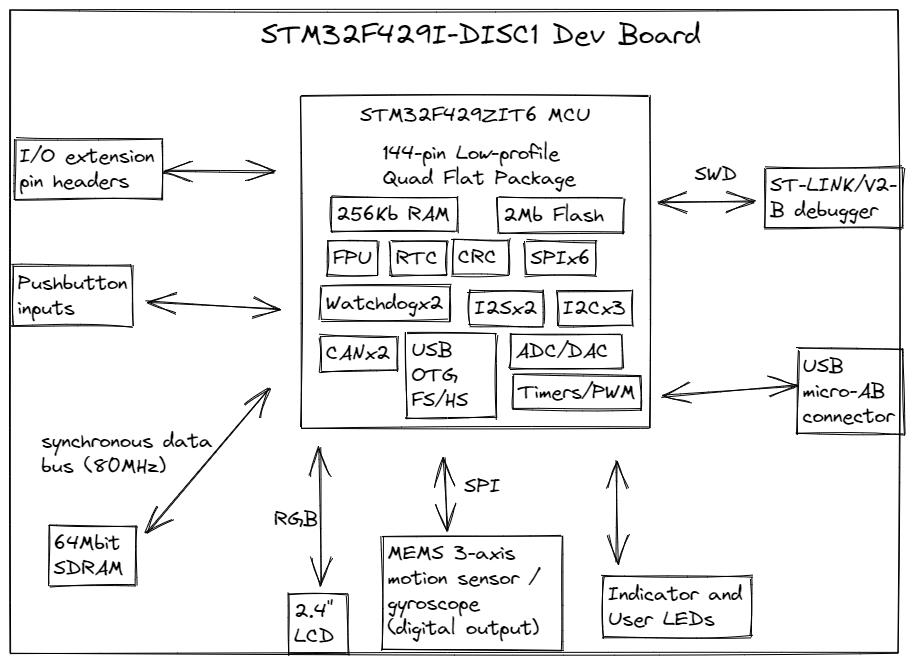
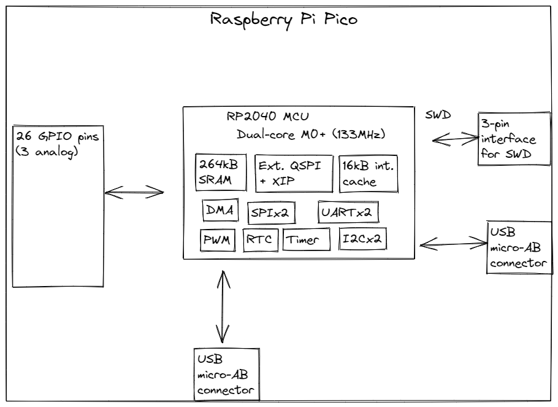

# Investigate Project Boards

## Block Diagram

### STM32F429I-DISC1

### Raspberry Pi Pico

https://www.raspberrypi.com/documentation/microcontrollers/raspberry-pi-pico.html 

## Discussion and guiding questions

||STM32F429I-DISC1|Raspberry Pi Pico| 
|---|---|---|
|What kind of processor is it?|STM32F429ZIT6|RP2040|
|How much flash and RAM?|2Mb flash, 256kB RAM|no flash, 264kB SRAM|
|Any other types of memory?| ext. SDRAM| int. cache|
|What the features of the ADC(s), if any?|3 12-bit ADC peripherals with 8 channels ea. @ 2.4 million samples/second|4-channel 12-bit ADC, 500k samples/second|
|Compare the cost of the board vs the processor:|$30/kit, $20/chip|$4/kit, $1/chip|
|Is the processor even in stock anywhere?|According to Octopart, 30k in stock at IBuyXS, $49/ea at MOQ of 100|Yes, lots at Digi-Key >10k|